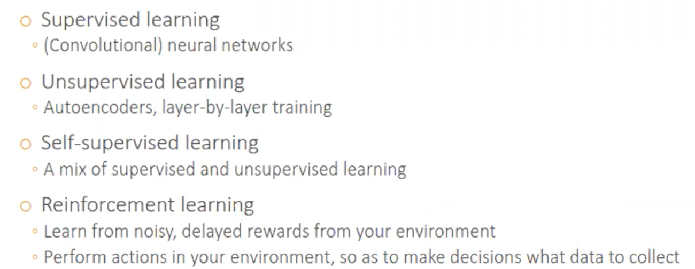

Traditional ML

Deep learning： Feature Learn automatically ； end-to-end

# 概论

Hierachial: 第一层：有没有一个edge；第二层：眼鼻口；第三层：脸

Nonlinear:  BG： XOR问题 exclusive or

x1 x2 其中之1是1，那么y是1；

BG： tabular data 也叫做 structured data

DL 的好处2是可以融合不同的数据集

## Why  not 1layer and many  nodes  , but instead deep layers?

1层+很多节点只能模拟 training error； 考虑到 test error  多层数更好

## DL的神经网络类型分类

standard NN 别名 Multilayer Perceptron

## Types of Learning

在7011只讨论 将 DL应用到 supervised learning 当中，实际上可以用来做很多事情

## FrameWork

如何理解 tensowflow symbolic：

z=x+y 不会执行计算，只是单纯列式子；类似C++

pytorch： 

交互计算：z=x+y 立刻执行计算 

deploy it to larger dataset；会慢

Keras： FPP3 Package

# 课程大纲

# 老师的建议

 Copy + UnderStand+ Modify

# 大纲

# Linear Reg

d (dimension)：numer of predictors

xi ： predictor xi

Weighted average

## Optimization

## 总结

注意这里 学习率和starting point 都是要决定的东西

# Logistic Reg

这里这个 指数项某种程度上衡量了 Y=1发生的可能性，虽然值域是-00 - +00，不是概率，但是仍能代表一些东西

这里深度学习计算的score类似于 之前学习的log

Hard Max not differentiable ；因为 Y 预测如果用max来预测，就 not differentiable；这样的话计算损失函数就很麻烦

## Soft Max  

等价转换； 最大化概率 等于最小化负对数概率

# Perceptron

you give me x ,I calculate f(x) I only care about the sign of x

当是 linear decision boundary的时候，其实是内积的形式

所以引入 

## Multilayer Perception

## 总结

ActivationFunction 是  element wised on these vectors

Forward Propogation

Why is called activation function

类比神经元；先经过h，决定是否传送信息；

how much information should I send to the next layer

老师评价：never use sigmoid activation function unless binary classfication

为什么有 sigmoid： 因为原来的 sign是不可导的，这样是可导的

Use RELU if u have no other choice

## 老师的建议

