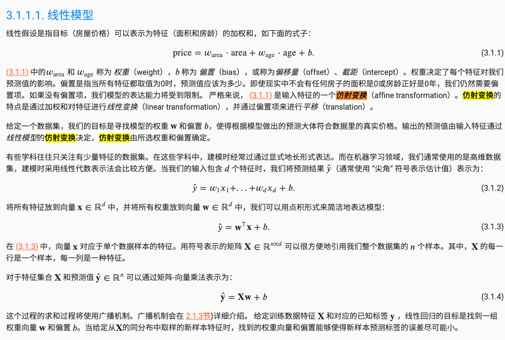

复习仿射变换：

# 框架

机器学习的目标是 发现模式；而不是记住数据

根本问题： 发现可以泛化的模式，而不是记住数据

## 过拟合 正则化

将模型在训练数据上拟合得比在潜在分布中更接近的现象称为*过拟合*，用于对抗过拟合的技术称为*正则化*。

为了进一步讨论这一现象，我们需要了解训练误差和泛化误差。*训练误差*（training error）是指，我们的模型在训练数据集上计算得到的误差。*泛化误差*（generalization error）是指，当我们将模型应用在同样从原始样本的分布中抽取的无限多的数据样本时，我们模型误差的期望。

假设：

在有监督中，我们到目前为止都基于一个假设，并且这个假设将贯穿本书的大部分内容。即我们假设训练数据和测试数据都是从*相同的*分布中*独立*提取的。这通常被称为*独立同分布假设*（i.i.d. assumption），这意味着对数据进行采样的过程没有进行“记忆”。换句话说，抽取的第2个样本和第3个样本的相关性并不比抽取的第2个样本和第200万个样本的相关性更强。

