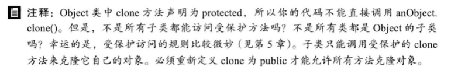
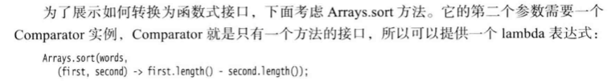

# 简介

接口：“What： 描述类的功能，而并不实现

lambda表达式：表示可以在将来某个时间点执行代码块的方法；意义：简洁方式回调或变量行为

内部类：定义在另外一个类的内部；方法可以访问包含外部类的域；意义：设计具有协作关系的类

代理：proxy ：实现任意接口的对象

备注： 2021年04月12日14:26:04

6.3-6.5不怎么看得懂！

# 接口

对类的需求描述

eg： Comparable 

## 特性

* 不能实例化 new/不能构造
* 可以声明接口类型的变量！ Comparable X;
* 接口变量必须引用实现了类接口的对象！  X= new Employee();
* 接口不能包含实例域和静态方法（java8可以），可以有常量

接口和接口之间可以继承；（扩展）

## 接口 VS 抽象类

抽象类只能继承一个，但是可以有很多接口

## 实例

回调（callback） 特定事件发生应该采取的工作

comparator接口

Cloneable接口 (clone 方法是 protected?)

>  包含对象引用变量的copy：原变量和副本都是指向同一个对象！

图例：

概念： 浅拷贝 深拷贝 

注意这里超类已经实现了 clone方法（但是是 protected)

## 还是不太理解

# lambda

核心：封装代码块（封装一些计算）

把lambda表达式看作是一个函数么不是对象；lambda表达式可以传递到函数式接口；lambda表达式可以转换为接口；

## 函数式接口

对于只有一个抽象方法的接口， 需要这种接口的对象时， 就可以提供一个 lambda 表达式。 这种接口称为函数式接口 (functional interface )。

eg

# 内部类

> 情景：从传统意义 上讲， 一个方法可以引用调用这个方法的对象数据域。 只有内部类可以是私有类， 而常规类只可以具有包可见性， 或公有可见性。
>
> 内部类：内部类既可以访问自身的数据域， 也可以访问创建它的外围类对象的数据域.

不是关键字：outer！

正确语法： OuterClass.this   外围类的引用 

outerObject.new InnerClass{constructionparameters)

可以访问 定义为final的局部变量

匿名·内部类：将局部内部类的使用再深人一步。假如只创建这个类的一个对象， 就不必命名了。这种类被称为 匿名内部类(anonymous inner class)。

# 代理

意义：运行时创建一个实现了给定接口的新类

场景：编译时无方法确定实现那个借口

