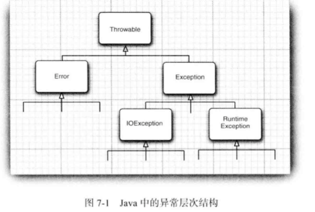
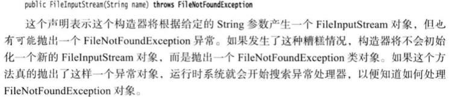
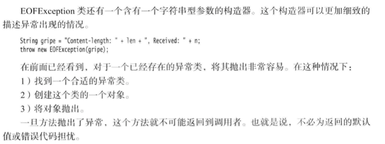

# 异常

exception handling 异常处理

日志：程序错误，不能总是和用户/终端进行沟通，想记录出现的问题，以备日后分析

异常处理：异常处理的任务就是将控制权从错误产生的地方转移给能够处理这种情况的错误处理 器。

> 正如第 5 章中所叙述的那样， 在 Java 中， 如果某个方法不能够采用正常的途径完整它的 任务， 就可以通过另外一个路径退出方法。 在这种情况下， 方法并不返回任何值， 而是抛出 (throw) 一个封装了错误信息的对象
>
> 需要注意的是，这个方法将会立刻退出，并不返回任 何值。 此外， 调用这个方法的代码也将无法继续执行， 取而代之的是， 异常处理机制开始搜 索能够处理这种异常状况的异常处理器 (exception handler )。

## 结构图

Error 类层次结构描述了 Java 运行时系统的内部错误和资源耗尽错误。 应用程序不应该 抛出这种类型的对象。 

在设计 Java 程序时， 需要关注 Exception 层次结构。 这个层次结构又分解为两个分支: 一个分支派生于RuntimeException; 另一个分支包含其他异常。划分两个分支的规则是:由 程序错误导致的异常属于RuntimeException; 而程序本身没有问题，但由于像I/O错误这类 问题导致的异常属于其他异常:

声明异常

捕获异常

